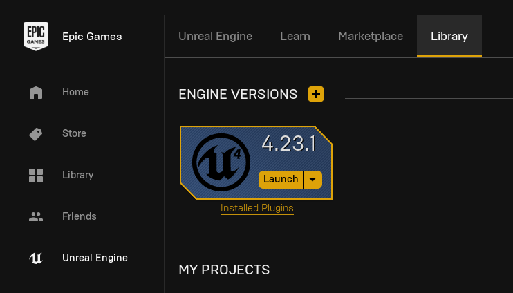
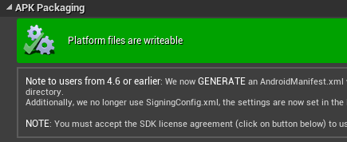

# Unreal Engine 4: Installation Instructions

1. Download and install the **Epic Games Launcher** from the official [Epic Games](https://www.epicgames.com/unrealtournament/download) website. You need an Epic Games login to use the Epic Games Launcher.
2. From the Epic Games Launcher, move to *Unreal Engine - Library* and install the latest 4.23 version.
*(At least 15GB of disk space are required)*

3. In order to build projects to Android, you need **CodeWorks for Android** installed.
After the Engine is installed, the Installer for CodeWorks is located at `[EngineInstallLocation]\UE_4.23\Engine\Extras\AndroidWorks`.
If the installation process is unclear, head over to the [Unreal Engine documentation](https://docs.unrealengine.com/en-US/Platforms/Mobile/Android/InstallingAndroidCodeWorksAndroid/index.html) for step-by-step instructions.
4. As soon as CodeWorks is installed, open the project by opening the `HighTowerUE4.uproject` file in the `HighTowerUE4` folder. 
This will open the Level Editor for this project.
    * If the level isn't visible on the Viewport or appears black, navigate to `Content/SideScrollerBP/Maps` and double-click the **HighTowerMap**.
5. Navigate to *Settings &rarr; Project Settings &rarr; Platforms - Android* and check if the project is optimized for Android.
If not, simply click the button to optimize it.

6. After completing these steps, plug in your Android phone to your computer or start your emulated device.
In the Toolbar, click on the Arrow next to *Launch* and select your Android device.
The game will be built and transferred to your device. You should see the main screen of the game as soon as the launch is completed. 

