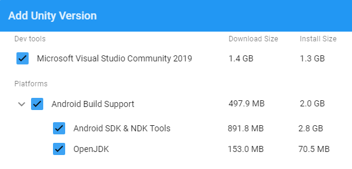
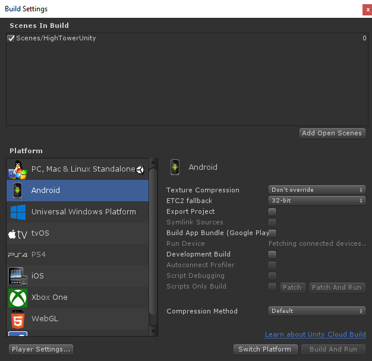

# Unity: Installation Intructions

1. Download and install the **Unity Hub** from the official [Unity](https://unity3d.com/get-unity/download) website.
You need a Unity ID to use the Unity Hub.
2. To use any version of the Unity Engine, you need a license.
Simply open the Unity Hub and navigate to *Preferences &rarr; License Management* and click on the `Activate New License` button.
From there you can select *Unity Personal*, which can be used unlimited and for free (more information on [Unity Pricing & Plans](https://store.unity.com/#plans-individual))
3. To install the required engine version from the Unity Hub, navigate to *Installs*, click on the `Add` button.
From there, select the version 2019.2.6f1 *(if this exact version isn't available anymore, select any 2019.2.xxf1 version)* and click next. *(For the Engine itself, at least 4GB of disk space are required)*
4. In the following window, where you select modules for your engine installation, select at least `Android Build Support` (if not already installed, please also install Android SDK & NDK Tools and OpenJDK).
This will allow you to build the game project directly to an Android device or emulated device.
After selecting all required modules, you have to wait until the installation finishes.

5. As soon as the Engine and the required modules are installed, navigate to the *Projects* section and click on the `Add` button.
Navigate inside of the `HighTowerUnity` folder and choose this folder.
Now you can open the project from Unity Hub.
6. The Unity Editor opens the game in the Scene Editor. Should the scene not be shown, navigate to `Assets/Scenes` and double-click on the **HighTowerUnity** scene to load it.
7. Navigate to *File &rarr; Build Settings...* where you can select the build platform. 
Choose Android and click on the `Switch platform` button.

8. When all these steps are completed, plug in your Android device or start your emulated device.
At *Run Device* you should be able to select your connected device.
Now click on the `Build and Run` button and select where the built APK file should be saved.
This process will save an APK file to your computer and install the game directly to your device.
After building and deploying the game, it should start running on your device soon.

